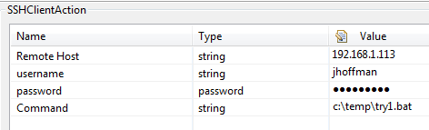

<html xmlns="http://www.w3.org/1999/xhtml">
<head>
    <title>Overview</title>
    <meta http-equiv="Content-Type" content="text/html; charset=UTF-8"/>
    <meta http-equiv="X-UA-Compatible" content="IE=EmulateIE8" />
    <meta content="Scroll Wiki Publisher" name="generator"/>
    <link type="text/css" rel="stylesheet" href="css/blueprint/liquid.css" media="screen, projection"/>
    <link type="text/css" rel="stylesheet" href="css/blueprint/print.css" media="print"/>
    <link type="text/css" rel="stylesheet" href="css/content-style.css" media="screen, projection, print"/>
    <link type="text/css" rel="stylesheet" href="css/screen.css" media="screen, projection"/>
    <link type="text/css" rel="stylesheet" href="css/print.css" media="print"/>
</head>
<body>
                <h1>Overview</h1>
    

            
            

    

The SSH Client Action Plugin executes any arbitrary command or script on any SSH accessible remote machine.  It can be used as an Incident Action plugin to perform some action on a remote machine as a result of an incident triggering.    

    

        <table>
<thead class=" "></thead><tfoot class=" "></tfoot><tbody class=" ">    <tr>
            <td rowspan="1" colspan="1">
        

Name    

            </td>
                <td rowspan="1" colspan="1">
        

<strong class=" ">SSH Action Plugin</strong>    

            </td>
        </tr>
    <tr>
            <td rowspan="1" colspan="1">
        

Plug-In Version    

            </td>
                <td rowspan="1" colspan="1">
        

1.0.2    

            </td>
        </tr>
    <tr>
            <td rowspan="1" colspan="1">
        

Compatible with    

            </td>
                <td rowspan="1" colspan="1">
        

dynaTrace 4.x    

            </td>
        </tr>
    <tr>
            <td rowspan="1" colspan="1">
        

Author    

            </td>
                <td rowspan="1" colspan="1">
        

Joe Hoffman (joseph.hoffman@compuware.com)    

            </td>
        </tr>
    <tr>
            <td rowspan="1" colspan="1">
        

License    

            </td>
                <td rowspan="1" colspan="1">
        

<a href="attachments_5275722_2_dynaTraceBSD.txt">dynaTrace BSD</a>    

            </td>
        </tr>
    <tr>
            <td rowspan="1" colspan="1">
        

Support    

            </td>
                <td rowspan="1" colspan="1">
        

<a href="https://community/display/DL/Support+Levels">Community Supported</a>    

            </td>
        </tr>
    <tr>
            <td rowspan="1" colspan="1">
        

Downloads    

            </td>
                <td rowspan="1" colspan="1">
        

<a href="attachments_88440991_1_com.dynatrace.sshClient_1.0.2.jar">com.dynatrace.sshClient_1.0.2.jar</a>    

            </td>
        </tr>
    <tr>
            <td rowspan="1" colspan="1">
        

Key benefits    

            </td>
                <td rowspan="1" colspan="1">
        

Ensures encrypted communication with remote machine Executes any command or script Open source: Adaptable as necessary OS Independent Uses the jsch (java Secure Channel) encryption package which is an implementation of SSH2    

            </td>
        </tr>
    <tr>
            <td rowspan="1" colspan="1">
        

Additional Notes    

            </td>
                <td rowspan="1" colspan="1">
        

It accepts SSH connections from whatever responds on port 22 on the specified machine.  This means that it could be vulnerable to a Man in the Middle attack.    Therefore we suggest running it on and across only trusted networks. This plugin requires an SSH service be running on the specified remote machine.  FreeSSHd is a good option for any OS that does not have SSH natively.    

            </td>
        </tr>
    <tr>
            <td rowspan="1" colspan="1">
        

Configuration    

            </td>
                <td rowspan="1" colspan="1">
        

    

    

        <table>
<thead class=" "></thead><tfoot class=" "></tfoot><tbody class=" ">    <tr>
            <td rowspan="1" colspan="1">
        

            
            

            </td>
        </tr>
    <tr>
            <td rowspan="1" colspan="1">
                </td>
        </tr>
</tbody>        </table>
            

            </td>
        </tr>
    <tr>
            <td rowspan="1" colspan="1">
        

Debugging    

            </td>
                <td rowspan="1" colspan="1">
        

Output from the executed command is written to the plugin log which can be found in the log directory of the Collector where the plugin is being executed.    

            </td>
        </tr>
</tbody>        </table>
            

    

<strong class=" ">Additional suggested Improvements</strong>    

<ul class=" "><li class=" ">    

Provide a switch to be able to disable logging for verbose commands    

</li><li class=" ">    

Regex Match for output match    

</li><li class=" ">    

Configurable as a task    

</li><li class=" ">    

Success criteria    

</li><li class=" ">    

Make the SSH port configurable    

</li><li class=" ">    

Most of these features would be attainable by adding this SSH functionality to the Generic Execution Plugin and making the SSH feature optional.    

</li></ul>    

    

    

        <table>
<thead class=" ">    <tr>
            <td rowspan="1" colspan="1">
        

&nbsp;    

            </td>
                <td rowspan="1" colspan="1">
        

<a href="SSH_Action_Plugin.html">File</a>    

            </td>
                <td rowspan="1" colspan="1">
        

<a href="SSH_Action_Plugin.html">Modified</a>    

            </td>
        </tr>
</thead><tfoot class=" "></tfoot><tbody class=" ">    <tr>
            <td rowspan="1" colspan="1">
                </td>
                <td rowspan="1" colspan="1">
        

Java Source                    <a href="https://community/download/attachments/88245112/com.dynatrace.sshClient_1.0.2.jar?api=v2">com.dynatrace.sshClient_1.0.2.jar</a>    

            </td>
                <td rowspan="1" colspan="1">
        

Jul 13, 2012by<a href="    /community/display/~joseph.hoffman@compuware.com ">Joe Hoffman</a>    

            </td>
        </tr>
    <tr>
            <td rowspan="1" colspan="1">
                </td>
                <td rowspan="1" colspan="2">
        

    

    

Labels    

<ul class="label-list has-pen "><li class="no-labels-message ">    

No labels    

</li><li class="labels-edit-container ">    

<a href="SSH_Action_Plugin.html">Edit Labels</a>    

</li></ul>    

    

            </td>
        </tr>
</tbody>        </table>
            

<ul class=" "><li class="drop-zone-text hidden ">    

Drag and drop to upload or browse for files    

            
        </li></ul>    

Upload fileFile description    

            

        

        

        

    

</body>
</html>
