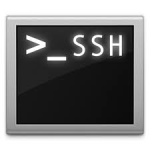

## SSH Action Plugin

The SSH Client Action Plugin executes any arbitrary command or script on any SSH accessible remote machine. It can be used as an Incident Action plugin to perform some action on a remote machine as a
result of an incident triggering.

Find further information in the [dynatrace community](https://community.compuwareapm.com/community/display/DL/SSH+Action+Plugin)

